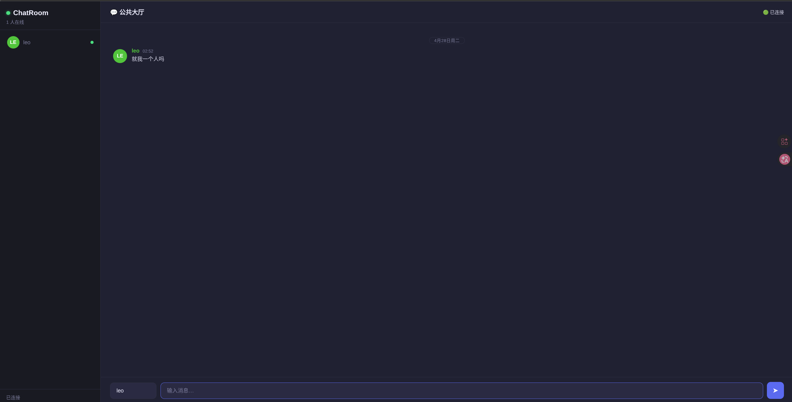
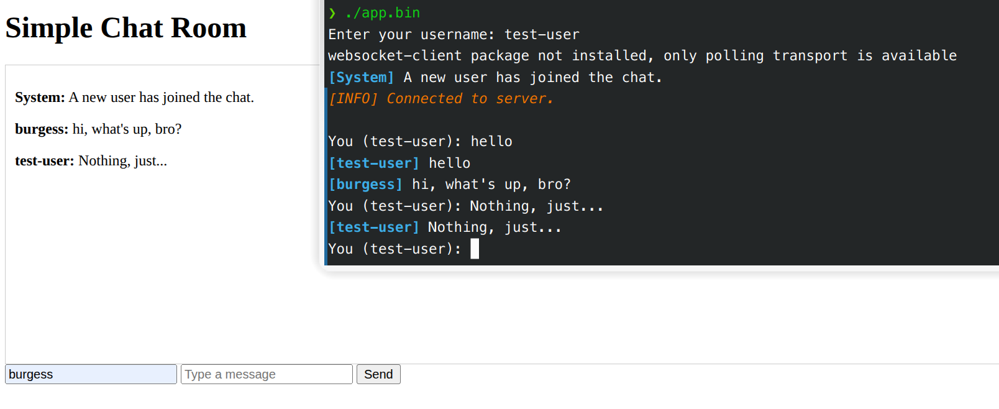
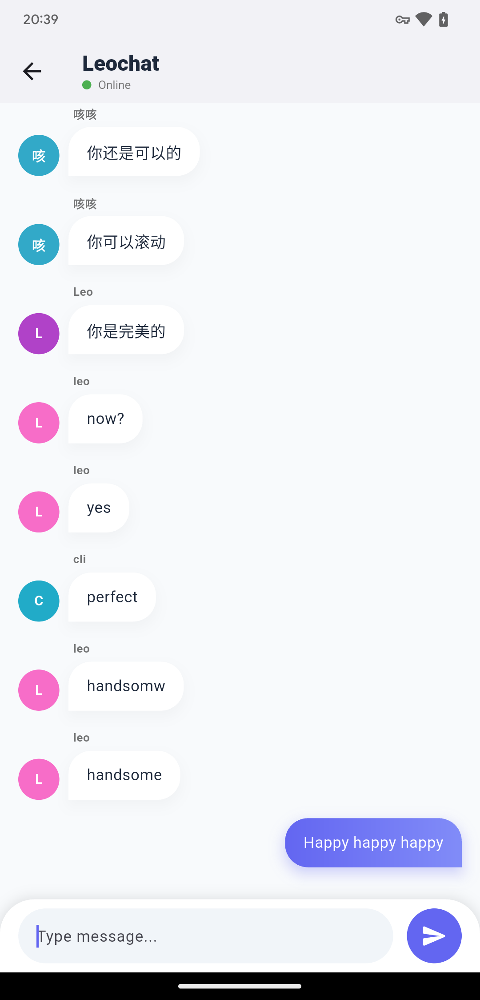

# Leochat — 多端实时聊天室

一个轻量级、自托管的实时聊天应用，支持 Web / 终端 / 移动端三端接入。

```
leochat/
├── server/          Python 后端 (Flask + Socket.IO)
├── cli/             终端客户端 (Rich + prompt_toolkit)
└── android/         Flutter 移动客户端 (Android / iOS / Web)
```

---

## 功能特性

- **实时消息** — Socket.IO 驱动的低延迟双向通信
- **在线用户列表** — 实时显示当前在线用户
- **速率限制** — 2 秒内最多 5 条消息，防止刷屏
- **消息时间戳** — 每条消息附带发送时间
- **系统通知** — 用户加入/离开自动广播
- **环境变量配置** — 关键参数全部可配，无需改代码

---

## 快速开始

### 前提条件

- Python 3.12+
- [uv](https://docs.astral.sh/uv/) (推荐) 或 pip
- Flutter 3.x (仅 Android 端)

### 1. 启动服务端

```bash
cd server

# 安装依赖
uv sync

# 启动 (默认 http://0.0.0.0:5000)
uv run python app.py
```

浏览器打开 `http://localhost:5000` 即可使用 Web 版。

### 2. 终端客户端

```bash
cd cli
uv sync
uv run python app.py
```

输入昵称后进入聊天。支持 `/exit`、`/users`、`/help` 命令。

### 3. Android 客户端

```bash
cd android
flutter pub get
flutter run --dart-define=SERVER_IP=你的服务器IP --dart-define=SERVER_PORT=5000
```

---

## 配置

通过环境变量或项目根目录 `.env` 文件配置：

| 变量 | 默认值 | 说明 |
|------|--------|------|
| `SECRET_KEY` | 随机生成 | Flask 密钥，生产环境务必设置 |
| `CHAT_PORT` | `5000` | 服务器端口 |
| `CHAT_DEBUG` | `false` | 调试模式 (`true`/`1`) |
| `CHAT_SERVER` | `http://127.0.0.1:5000` | CLI 连接的服务器地址 |
| `SERVER_IP` | `127.0.0.1` | CLI 服务器 IP |
| `SERVER_PORT` | `5000` | CLI 服务器端口 |

---

## Docker 部署

```bash
cd server
docker compose up -d
```

---

## 协议设计

### 客户端 → 服务器

| 事件 | 载荷 | 说明 |
|------|------|------|
| `join` | `{user: "name"}` | 注册用户名 |
| `send_message` | `{user, text, time}` | 发送消息 |

### 服务器 → 客户端

| 事件 | 载荷 | 说明 |
|------|------|------|
| `message` | `{user, text, time}` | 聊天消息（广播） |
| `system` | `{text}` | 系统通知（加入/离开） |
| `error` | `{text}` | 错误提示 |
| `userlist` | `{users: [...]}` | 在线用户列表 |

---

## 技术栈

| 组件 | 技术 |
|------|------|
| 服务端 | Flask 3.x, Flask-SocketIO 5.x, Python 3.12+ |
| CLI | Rich, prompt_toolkit, python-socketio |
| Android | Flutter 3.x, socket_io_client |
| 部署 | Docker, docker-compose |

---

## 界面预览

### Web 端 (Server)



### 终端客户端 (CLI)



### 移动客户端 (Android)



## License

[Apache](LICENSE)
