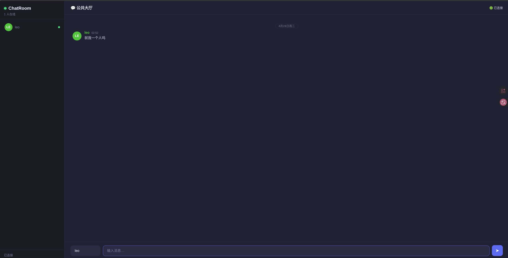
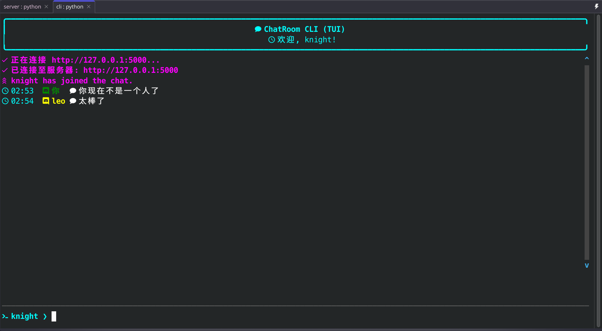
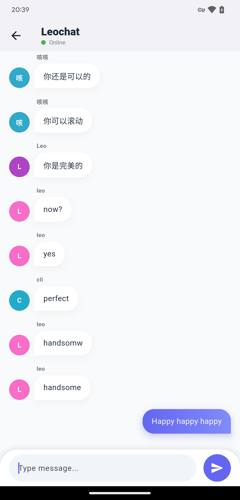

# Leochat — 多端实时聊天室

轻量级、自托管的实时聊天应用，支持 Web / CLI / Android / AI Agent 四端接入。

```
leochat/
├── server/          Python 后端 (Flask + Socket.IO + gunicorn)
├── cli/             终端客户端 (prompt_toolkit)
├── android/         Flutter 移动客户端
├── agent/           AI 聊天机器人 (DeepSeek + Tavily)
└── assets/          界面预览
```

## 功能特性

- **实时消息** — Socket.IO 驱动的双向通信
- **AI Agent** — 自主聊天机器人，以普通用户身份加入，自行判断何时发言
- **Web 管理后台** — 消息管理、禁言/封禁、敏感词过滤、系统广播、聊天导出
- **数据持久化** — SQLite 存储消息、用户、配置
- **头像系统** — 自动分配 + 持久化，11 种头像
- **速率限制** — 2 秒内最多 10 条消息
- **系统通知** — 用户加入/离开自动广播，置顶公告
- **多端同步** — 消息删除、撤回实时同步到所有客户端
- **自动重连** — 所有客户端断线后自动恢复

## 快速开始

### 前提条件

- Python >= 3.12
- [uv](https://docs.astral.sh/uv/)（推荐）或 pip
- Flutter 3.x（仅 Android 端）

### 1. 启动服务端

```bash
cd server
uv sync
uv run python app.py        # 开发模式，http://0.0.0.0:5000
```

浏览器打开 `http://localhost:5000` 进入 Web 管理后台（密码见控制台输出）。

### 2. 终端客户端

```bash
cd cli
uv sync
uv run python app.py
```

支持 `/users`、`/exit`、`/help` 命令。配置持久化在 `~/.config/leochat/config.toml`。

### 3. Android 客户端

```bash
cd android
flutter pub get
flutter run --dart-define=SERVER_IP=你的服务器IP --dart-define=SERVER_PORT=5000
```

### 4. AI Agent

```bash
cd agent
# 设置 API key
export DEEPSEEK_API_KEY=sk-xxx
export TAVILY_API_KEY=tvly-xxx   # 可选，联网搜索

uv sync
uv run python app.py
```

详见 [agent/README.md](agent/README.md)。

## Docker 部署

在项目根目录：

```bash
# 设置环境变量
cp .env.example .env
# 编辑 .env：填写 DEEPSEEK_API_KEY 等

docker compose up -d
```

这会启动两个服务：
- `leochat-server` — 聊天服务器（端口 5000）
- `leochat-agent` — AI 机器人（自动加入聊天室）

服务端使用 gunicorn + gevent 运行，数据库持久化在 Docker volume 中。

## 配置

### 服务端环境变量

| 变量 | 默认值 | 说明 |
|------|--------|------|
| `CHAT_PORT` | `5000` | 服务器端口 |
| `CHAT_DEBUG` | `false` | 调试模式 |
| `SECRET_KEY` | 随机生成 | Flask 密钥 |
| `WEB_PASSWORD` | 随机生成 | Web 管理后台登录密码 |
| `DB_PATH` | `leochat.db` | SQLite 数据库路径 |

### CLI 环境变量

| 变量 | 说明 |
|------|------|
| `LEOCHAT_SERVER` | 服务器地址，格式 `host:port` |
| `LEOCHAT_USER` | 用户名 |

优先级：CLI 参数 > 环境变量 > `~/.config/leochat/config.toml`

### Android 编译时变量

| 变量 | 默认值 | 说明 |
|------|--------|------|
| `SERVER_IP` | `192.168.1.45` | 默认服务器 IP |
| `SERVER_PORT` | `5000` | 默认服务器端口 |

### Agent 环境变量

| 变量 | 必需 | 说明 |
|------|------|------|
| `DEEPSEEK_API_KEY` | 是 | LLM API key |
| `TAVILY_API_KEY` | 否 | 联网搜索 API key |

详见 [agent/README.md](agent/README.md)。

## 协议设计

### 客户端 → 服务器

| 事件 | 载荷 | 说明 |
|------|------|------|
| `join` | `{user: "name"}` | 注册用户名 |
| `send_message` | `{text: "..."}` | 发送消息（用户名和时间由服务端自动绑定） |

### 服务器 → 客户端

| 事件 | 载荷 | 说明 |
|------|------|------|
| `message` | `{user, text, time}` | 聊天消息广播 |
| `system` | `{text}` | 系统通知（加入/离开） |
| `error` | `{text}` | 错误提示 |
| `announcement` | `{text}` | 置顶公告 |
| `userlist` | `{users: [{name, avatar}]}` | 在线用户列表 |
| `message_deleted` | `{id}` | 消息被删除 |
| `message_revoked` | `{id}` | 消息被撤回 |

## 技术栈

| 组件 | 技术 |
|------|------|
| 服务端 | Flask 3.x, Flask-SocketIO 5.x, gunicorn + gevent, SQLite |
| CLI | prompt_toolkit, python-socketio |
| Android | Flutter 3.x, socket_io_client |
| Agent | Python 3.12+, OpenAI SDK, python-socketio, Tavily |
| 部署 | Docker, docker-compose |

## 界面预览

### Web 管理后台



### CLI 客户端



### Android 客户端



## License

[Apache 2.0](LICENSE)
